# Firmware Call Graph

Standard DOT source below — render with Graphviz (`dot -Tsvg callgraph.md -o callgraph.svg`
after stripping the markdown fences) or paste into any online Graphviz viewer.

Interrupts are in a separate subgraph at the bottom.

---

## DOT source

```dot
digraph firmware {
    rankdir=LR;
    node [shape=box fontname="Courier" fontsize=10];
    edge [fontsize=9];

    /* ------------------------------------------------------------------ */
    /* Entry point                                                          */
    /* ------------------------------------------------------------------ */

    main [shape=ellipse];

    main -> peripherals_init;
    main -> dwt_initialise;
    main -> dwt_configure;
    main -> device_register;
    main -> device_init_from_hardware;
    main -> net_init;

    /* device_init_from_hardware selects one branch */
    main -> main_anchor_init  [label="MAIN_ANCHOR"];
    main -> anchor_init        [label="ANCHOR"];
    main -> tag_init           [label="TAG"];

    main -> main_anchor_loop  [label="loop/MAIN_ANCHOR"];
    main -> anchor_loop        [label="loop/ANCHOR"];
    main -> tag_loop           [label="loop/TAG"];

    /* ------------------------------------------------------------------ */
    /* MAIN ANCHOR path                                                     */
    /* ------------------------------------------------------------------ */

    main_anchor_init -> uart_init;
    main_anchor_init -> net_radio_init;
    main_anchor_init -> net_devices_init;

    main_anchor_loop -> uart_readline_idle;
    main_anchor_loop -> cmd_parse;
    main_anchor_loop -> process_command;
    main_anchor_loop -> poll_network;

    poll_network -> net_process;
    net_process  -> net_rx_poll;
    net_rx_poll  -> net_parse_message;
    net_rx_poll  -> rx_rbuf_pop;

    process_command -> handle_ping;
    process_command -> handle_initialize;
    process_command -> handle_reconfigure;
    process_command -> handle_reset;
    process_command -> handle_get_status;
    process_command -> handle_test_ss_twr;
    process_command -> handle_ranging_start;
    process_command -> handle_ranging_stop;
    process_command -> handle_set_ant_dly;
    process_command -> handle_set_temp_coef;
    process_command -> handle_debug;

    handle_initialize -> enumeration_start_master;
    handle_initialize -> configuration_start_master;
    handle_initialize -> configuration_perform_measurements;
    handle_initialize -> send_device_list_uart;
    handle_initialize -> send_table_uart;
    handle_initialize -> meas_table_print;

    handle_reconfigure -> configuration_start_master;
    handle_reconfigure -> configuration_perform_measurements;
    handle_reconfigure -> send_device_list_uart;
    handle_reconfigure -> send_table_uart;
    handle_reconfigure -> meas_table_print;

    handle_reset       -> net_devices_clear;
    handle_get_status  -> uart_printf;

    handle_test_ss_twr -> ss_twr_measure_distance;

    handle_ranging_start -> net_send_broadcast;
    handle_ranging_stop  -> net_send_broadcast;

    handle_set_ant_dly   -> ss_twr_set_ant_dly   [label="seq==own"];
    handle_set_ant_dly   -> send_net_cmd           [label="seq!=own"];
    handle_set_temp_coef -> ss_twr_set_temp_coef  [label="seq==own"];
    handle_set_temp_coef -> send_net_cmd           [label="seq!=own"];

    send_net_cmd         -> net_device_find_by_seq;
    send_net_cmd         -> net_send_to_16bit;

    handle_debug -> uart_dbg_set;

    send_device_list_uart -> net_devices_serialize;
    send_device_list_uart -> uart_putchar;
    send_table_uart        -> meas_table_serialize;
    send_table_uart        -> uart_putchar;

    /* main_anchor also receives ranging packets */
    main_anchor_loop -> main_anchor_idle [style=dashed label="no cmd"];
    main_anchor_idle -> ranging_handle_rx;
    ranging_handle_rx -> meas_table_deserialize;
    ranging_handle_rx -> meas_table_print;
    ranging_handle_rx -> uart_putchar;

    /* ------------------------------------------------------------------ */
    /* ANCHOR path                                                          */
    /* ------------------------------------------------------------------ */

    anchor_init -> net_radio_init;
    anchor_init -> net_devices_init;

    anchor_loop -> net_process;
    anchor_loop -> anchor_idle;

    anchor_idle -> cmd_parse;
    anchor_idle -> enumeration_handle_message;
    anchor_idle -> configuration_perform_measurements;
    anchor_idle -> configuration_send_measurements;
    anchor_idle -> ss_twr_set_ant_dly   [label="CMD_SET_ANT_DLY"];
    anchor_idle -> ss_twr_set_temp_coef [label="CMD_SET_TEMP_COEF"];

    /* ------------------------------------------------------------------ */
    /* TAG path                                                             */
    /* ------------------------------------------------------------------ */

    tag_init -> net_radio_init;
    tag_init -> net_devices_init;

    tag_loop -> net_process;
    tag_loop -> tag_idle;

    tag_idle -> cmd_parse;
    tag_idle -> enumeration_handle_message;
    tag_idle -> configuration_perform_measurements;
    tag_idle -> configuration_send_measurements;
    tag_idle -> ranging_handle_message;

    ranging_handle_message -> ranging_run;
    ranging_run -> do_ranging_cycle;
    ranging_run -> send_results;
    ranging_run -> check_stop;

    do_ranging_cycle -> ss_twr_measure_distance;
    do_ranging_cycle -> net_device_update_distance;

    send_results -> meas_table_serialize_row;
    send_results -> net_send_to_16bit;
    send_results -> net_device_find_by_seq;

    check_stop -> net_rx_poll;
    check_stop -> cmd_parse;

    /* ------------------------------------------------------------------ */
    /* Enumeration                                                          */
    /* ------------------------------------------------------------------ */

    enumeration_start_master -> net_devices_clear;
    enumeration_start_master -> net_send_broadcast;
    enumeration_start_master -> drain_rx;
    drain_rx -> enumeration_handle_message;

    enumeration_handle_message -> handle_discover;
    enumeration_handle_message -> handle_sync_list;
    enumeration_handle_message -> handle_device_response;

    handle_discover      -> net_send_to_64bit;
    handle_sync_list     -> deserialize_device_list;
    handle_sync_list     -> send_sync_list;
    send_sync_list       -> net_send_to_16bit;
    handle_device_response -> net_device_create;
    handle_device_response -> net_device_add;

    /* ------------------------------------------------------------------ */
    /* Configuration                                                        */
    /* ------------------------------------------------------------------ */

    configuration_start_master -> net_send_to_16bit;
    configuration_start_master -> net_rx_poll;
    configuration_start_master -> configuration_handle_message;

    configuration_handle_message -> cmd_parse;
    configuration_handle_message -> handle_measurements_cfg [label="handle_measurements()"];
    handle_measurements_cfg -> meas_table_deserialize;

    configuration_perform_measurements -> ss_twr_read_temperature;
    configuration_perform_measurements -> ss_twr_measure_distance;
    configuration_perform_measurements -> net_device_update_distance;

    configuration_send_measurements -> meas_table_serialize_row;
    configuration_send_measurements -> net_send_to_16bit;

    /* ------------------------------------------------------------------ */
    /* SS-TWR                                                               */
    /* ------------------------------------------------------------------ */

    ss_twr_measure_distance -> net_build_frame;
    ss_twr_measure_distance -> dwt_starttx;
    ss_twr_measure_distance -> dwt_readcarrierintegrator;
    ss_twr_measure_distance -> twr_calc_distance;

    ss_twr_read_temperature -> dwt_readtempvbat;
    ss_twr_read_temperature -> dwt_geticreftemp;

    ss_twr_set_ant_dly -> dwt_settxantennadelay;
    ss_twr_set_ant_dly -> dwt_setrxantennadelay;

    /* ------------------------------------------------------------------ */
    /* Network MAC layer                                                    */
    /* ------------------------------------------------------------------ */

    net_send_to_16bit  -> net_build_frame;
    net_send_to_64bit  -> net_build_frame;
    net_send_broadcast -> net_build_frame;
    net_build_frame    -> net_build_header;

    net_send_to_16bit  -> net_send_frame;
    net_send_broadcast -> net_send_frame;
    net_send_frame     -> net_send_frame_raw;

    net_send_frame_raw -> dwt_writetxdata;
    net_send_frame_raw -> dwt_writetxfctrl;
    net_send_frame_raw -> dwt_starttx;
    net_send_frame_raw -> dwt_rxenable;

    /* ------------------------------------------------------------------ */
    /* UART layer                                                           */
    /* ------------------------------------------------------------------ */

    uart_dbg    -> uart_vprintf;
    uart_printf -> uart_vprintf;
    uart_vprintf -> uart_putchar;
    uart_vprintf -> uart_puts;
    uart_puts    -> uart_putchar;

    /* ------------------------------------------------------------------ */
    /* Interrupts (separate subgraph)                                       */
    /* ------------------------------------------------------------------ */

    subgraph cluster_interrupts {
        label="Interrupt handlers";
        style=filled;
        color=lightyellow;
        node [style=filled fillcolor=lightyellow];

        SysTick_Handler;
        EXTI_DW1000_IRQ [label="EXTI (DW1000 IRQ)"];
        USART_IRQ       [label="USART IRQ (unused RX)"];

        SysTick_Handler -> portGetTickCount [label="increments tick"];

        EXTI_DW1000_IRQ -> dwt_isr;
        dwt_isr         -> net_rx_ok_isr;
        dwt_isr         -> net_rx_to_isr;
        dwt_isr         -> net_rx_err_isr;

        net_rx_ok_isr  -> dwt_readrxdata;
        net_rx_ok_isr  -> ss_twr_isr      [label="TWR responder frame"];
        net_rx_ok_isr  -> rx_rbuf_push    [label="other frames"];
        net_rx_ok_isr  -> dwt_rxenable;

        ss_twr_isr     -> dwt_readrxtimestamp;
        ss_twr_isr     -> dwt_setdelayedtrxtime;
        ss_twr_isr     -> dwt_writetxdata;
        ss_twr_isr     -> dwt_writetxfctrl;
        ss_twr_isr     -> dwt_starttx;

        net_rx_to_isr  -> dwt_rxenable;
        net_rx_err_isr -> dwt_rxenable;
    }
}
```



---

## Indented call tree (human-readable)

Calls to low-level deca API (`dwt_*`, `decamutex*`) are shown only where relevant
to understanding the flow; leaf calls to HAL and stdlib are omitted.

```
main()
├── peripherals_init()
├── dwt_initialise()
├── dwt_configure()
├── device_register()         [×N, builds device table]
├── device_init_from_hardware()
├── net_init()
│
├─[MAIN_ANCHOR]─────────────────────────────────────────────────────
│   main_anchor_init()
│   ├── uart_init()
│   ├── net_radio_init()
│   └── net_devices_init()
│
│   main_anchor_loop()   [infinite]
│   ├── uart_readline_idle()
│   ├── cmd_parse()
│   ├── poll_network()
│   │   └── net_process()
│   │       └── net_rx_poll()
│   │           ├── rx_rbuf_pop()
│   │           └── net_parse_message()
│   ├── process_command()
│   │   ├── handle_initialize()
│   │   │   ├── enumeration_start_master()
│   │   │   │   ├── net_devices_clear()
│   │   │   │   ├── net_send_broadcast()
│   │   │   │   └── drain_rx()
│   │   │   │       └── enumeration_handle_message()
│   │   │   │           ├── handle_discover()
│   │   │   │           │   └── net_send_to_64bit()
│   │   │   │           ├── handle_sync_list()
│   │   │   │           │   ├── deserialize_device_list()
│   │   │   │           │   └── send_sync_list()
│   │   │   │           │       └── net_send_to_16bit()
│   │   │   │           └── handle_device_response()
│   │   │   │               ├── net_device_create()
│   │   │   │               └── net_device_add()
│   │   │   ├── configuration_start_master()
│   │   │   │   ├── net_send_to_16bit()
│   │   │   │   ├── net_rx_poll()
│   │   │   │   └── configuration_handle_message()
│   │   │   │       ├── cmd_parse()
│   │   │   │       └── handle_measurements()  [static]
│   │   │   │           └── meas_table_deserialize()
│   │   │   ├── configuration_perform_measurements()
│   │   │   │   ├── ss_twr_read_temperature()
│   │   │   │   │   ├── dwt_readtempvbat()
│   │   │   │   │   └── dwt_geticreftemp()
│   │   │   │   ├── ss_twr_measure_distance()
│   │   │   │   │   ├── net_build_frame()
│   │   │   │   │   ├── dwt_starttx()
│   │   │   │   │   ├── dwt_readcarrierintegrator()
│   │   │   │   │   └── twr_calc_distance()  [static]
│   │   │   │   └── net_device_update_distance()
│   │   │   ├── send_device_list_uart()
│   │   │   │   ├── net_devices_serialize()
│   │   │   │   └── uart_putchar()
│   │   │   ├── send_table_uart()
│   │   │   │   ├── meas_table_serialize()
│   │   │   │   └── uart_putchar()
│   │   │   └── meas_table_print()
│   │   │
│   │   ├── handle_reconfigure()     [same as initialize minus enumeration]
│   │   ├── handle_reset()
│   │   │   └── net_devices_clear()
│   │   ├── handle_get_status()
│   │   │   └── uart_printf()
│   │   ├── handle_test_ss_twr()
│   │   │   └── ss_twr_measure_distance()
│   │   ├── handle_ranging_start()
│   │   │   └── net_send_broadcast()
│   │   ├── handle_ranging_stop()
│   │   │   └── net_send_broadcast()
│   │   ├── handle_set_ant_dly()
│   │   │   ├── ss_twr_set_ant_dly()          [if seq == own]
│   │   │   │   ├── dwt_settxantennadelay()
│   │   │   │   └── dwt_setrxantennadelay()
│   │   │   └── send_net_cmd()                 [if seq != own]
│   │   │       └── net_send_to_16bit()
│   │   ├── handle_set_temp_coef()
│   │   │   ├── ss_twr_set_temp_coef()         [if seq == own]
│   │   │   └── send_net_cmd()                  [if seq != own]
│   │   │       └── net_send_to_16bit()
│   │   └── handle_debug()
│   │       └── uart_dbg_set()
│   └── main_anchor_idle()               [no command arrived]
│       └── ranging_handle_rx()
│           ├── meas_table_deserialize()
│           ├── meas_table_print()
│           └── uart_putchar()           [forward raw packet to host]
│
├─[ANCHOR]──────────────────────────────────────────────────────────
│   anchor_init()
│   ├── net_radio_init()
│   └── net_devices_init()
│
│   anchor_loop()   [infinite]
│   ├── net_process()
│   └── anchor_idle()
│       ├── cmd_parse()
│       ├── enumeration_handle_message()
│       ├── configuration_perform_measurements()   [same subtree as above]
│       ├── configuration_send_measurements()
│       │   ├── meas_table_serialize_row()
│       │   └── net_send_to_16bit()
│       ├── ss_twr_set_ant_dly()          [CMD_SET_ANT_DLY]
│       └── ss_twr_set_temp_coef()        [CMD_SET_TEMP_COEF]
│
└─[TAG]─────────────────────────────────────────────────────────────
    tag_init()
    ├── net_radio_init()
    └── net_devices_init()

    tag_loop()   [infinite]
    ├── net_process()
    └── tag_idle()
        ├── cmd_parse()
        ├── enumeration_handle_message()
        ├── configuration_perform_measurements()
        ├── configuration_send_measurements()
        └── ranging_handle_message()
            └── ranging_run()
                ├── do_ranging_cycle()
                │   ├── ss_twr_measure_distance()
                │   └── net_device_update_distance()
                ├── send_results()
                │   ├── meas_table_serialize_row()
                │   └── net_send_to_16bit()
                └── check_stop()
                    ├── net_rx_poll()
                    └── cmd_parse()
```

---

## Interrupt handlers (separate)

```
EXTI (DW1000 IRQ line)
└── dwt_isr()                              [DecaWave library]
    ├── net_rx_ok_isr()                    [RXFCG event]
    │   ├── dwt_readrxdata()
    │   ├── ss_twr_isr()                   [if TWR response frame]
    │   │   ├── dwt_readrxtimestamp()
    │   │   ├── dwt_setdelayedtrxtime()
    │   │   ├── dwt_writetxdata()
    │   │   ├── dwt_writetxfctrl()
    │   │   └── dwt_starttx()
    │   ├── rx_rbuf_push()                 [other MAC frames → ring buffer]
    │   └── dwt_rxenable()
    ├── net_rx_to_isr()                    [RXRFTO / RXPTO event]
    │   └── dwt_rxenable()
    └── net_rx_err_isr()                   [RXPHE / RXFCE / RXRFSL event]
        └── dwt_rxenable()

SysTick_Handler
└── [increments portGetTickCount() counter]

USART IRQ
└── [raw byte → RX FIFO, consumed by uart_readline_idle()]
```
